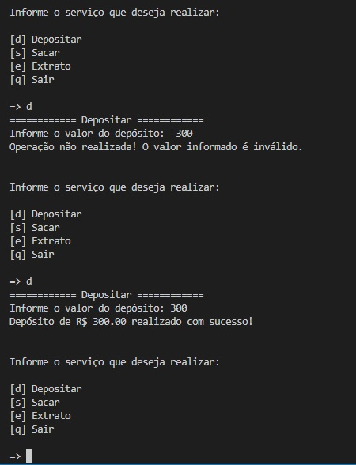
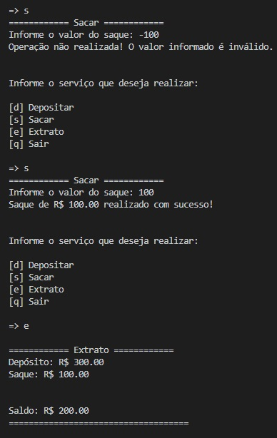

# Desafio sistema bancário com Python

## Objetivo geral:
Criar um sistema bancário com as operações sacar, depositar e visualizar extrato.

## Desafio: 
Fomos contratados por um grande banco para desenvolver o seu novo sistema. Esse banco deseja modernizar suas operações e para isso escolheu a linguagem Python Para a primeira versão do sistema devemos implementar apenas 3 operações depósito, saque e extrato.

## Operação de depósito: 
Deve ser possível depositar valores positivos para a minha conta bancária. A v1 do projeto trabalha apenas com 1 usuário, dessa forma não precisamos nos preocupar em identificar qual é o número da agência e conta bancária. Todos os depósitos devem ser armazenados em uma variável e exibidos na operação de extrato.

## Operação de saque: 
O sistema deve permitir realizar 3 saques diários com limite máximo de R$ 500.00 por saque. Caso o usuário não tenha saldo em conta, o sistema deve exibir uma mensagem informando que não será possível sacar o dinheiro por falta de saldo. Todos os saques devem ser armazenados em uma variável e exibidos na operação de extrato.

## Operação de extrato: 
Essa operação deve listar todos os depósitos e saques realizados na conta. No fim da listagem deve ser exibido o saldo atual da conta. Se o extrato estiver em branco, exibir a mensagem: Não foram realizadas movimentações.
Os valores devem ser exibidos utilizando o formato R$ xxx.xx, exemplo:

1500.45 = R$ 1500.45

## Resultados obtidos:

### Procedimento de depósito

### Procedimento de saque e extrato

